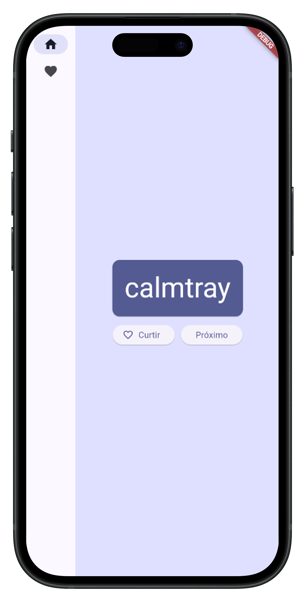
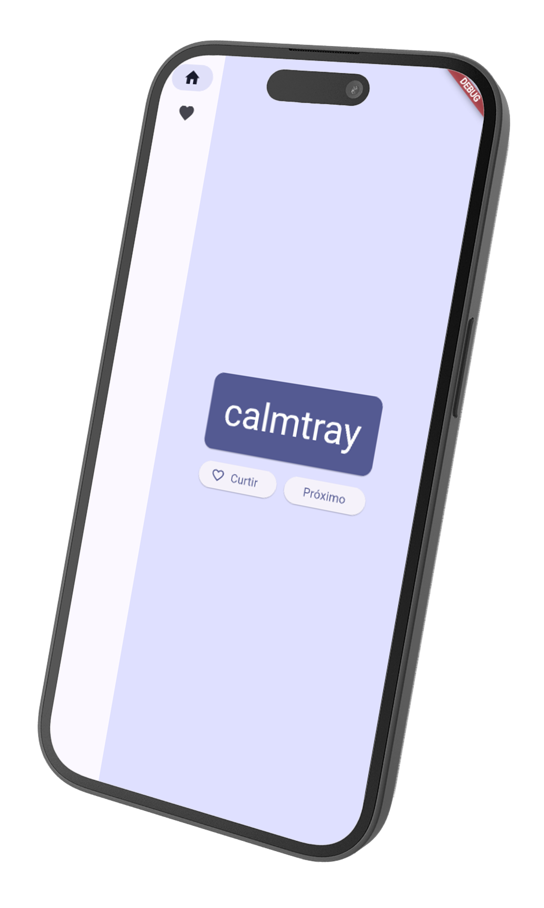

<h1 align="center">🚀 Namer App</h1>

  

    Aplicativo Flutter desenvolvido com base no <strong>Codelab oficial da Google</strong>.  
    O Namer App gera pares de palavras aleatórias, permite salvar seus favoritos ❤️ e alternar entre telas com uma navegação lateral elegante usando <code>NavigationRail</code>.
  

  

    📱 Ideal para aprender conceitos fundamentais do Flutter:  
    gerenciamento de estado com <code>Provider</code>, design responsivo, widgets personalizados e muito mais!
  

---

<h2>💻 Tecnologias Utilizadas</h2>

  

---

<h2>📖 Sobre o Projeto</h2>

<ul>
  <li>🔀 Geração de nomes com o pacote <code>english_words</code></li>
  <li>🧠 Gerenciamento de estado usando <code>Provider</code></li>
  <li>🎯 Interface com <code>NavigationRail</code> para uma navegação fluida</li>
  <li>❤️ Sistema de favoritos com persistência local (em breve)</li>
</ul>

---

<h2>📸 Preview do App</h2>

  
  

---

<h2>🌐 Minhas Redes Sociais</h2>

  
  
  

---

## 👨‍💻 Autor

  <a href="https://github.com/joao-victor-fonseca" target="_blank">
    
     
    <b>João Victor Fonseca Assis</b>
  </a>

  Desenvolvido com ❤️ por <strong>João Victor Fonseca Assis</strong>. 
  Entre em contato para dúvidas, ideias ou colaborações!

